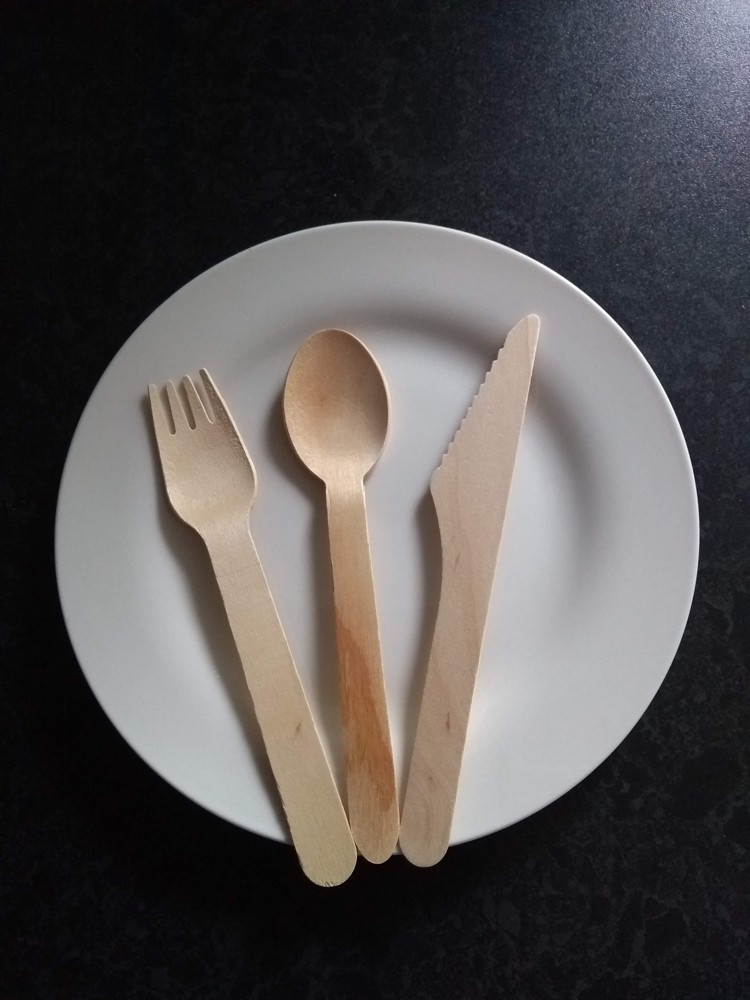

# 🔪 K N I F E 🔪
Do you like overthinking? Do you like overkill? Well you're going to love Knife, a fake hypothetical project. 
Maintained by Forks Inc, a fake up and coming startup. 

## Summary
A project that integrates with the github api in order to fork itself. Run it with flask to try it out. The design is very human.

## Doing something
Once you've got the flask app running, go to the browser and click "I want to fork knife."

## Prereqs
* Python 3.x
* Flask  
* Requests
* A github account with an oauth app configured

## References
* https://docs.github.com/en/developers/apps/authorizing-oauth-apps
* https://github.com/settings/applications/new
* https://docs.github.com/en/developers/apps/scopes-for-oauth-apps#available-scopes
* https://docs.github.com/en/rest/reference/repos#forks

## To set up and run locally (dev only)
* go here and create a new app: https://github.com/settings/applications/new
    * use http://localhost:5000/ as the home
    * use http://localhost:5000/authenticated/
* obtain client id and client secret from github app setup
* add `github_client_id`, `github_client_secret` to your conf (around line 6 of [knife.py](knife.py))
* add a unique `state` to the conf object
* install prereqs (separately install with pip/pip3 or `pip3 install -r requirements.txt`)
* run `python3 knife.py`

## To fork this repo
* Option #1: Set up everything on a dev server (above), go to http://localhost:5000, click on the link.
* Option #2: [Click here](https://github.com/ForksInc/knife/fork).
* Option #3: Write a slack bot that automatically provisions a vm, starts knife.py, and sends you the link that you can then click!
* Option #4: Hire an intern and ask them to do it.

## A product backlog of sorts
In no particular order...
* Add more granular error handling/logging.
* Add logging of any kind.
* Add a test framework.
* Allow user to select if they want to fork to their personal account or org.
* Handle async call - the fork api call technically just starts the fork process, but we could technically come back and confirm that it actually did it. Although, in testing it's always just there when we present the link to the user.
* Handle user already forked situation - currently, it just acts like it newly forked even if the user had already. 
* Don't run flask dev server for prod - instead consider uwsgi/nginx, for example.
* Add more functionality beyond what already ([exists](https://github.com/ForksInc/knife/fork)) in github natively.
* Find a use case for this.
* Create IOS/Android app, preferably with ads and in-app purchases - fork with flair?
* Convince a youth to do something with it on tiktok. 
* Get VC funding $$$$$.
